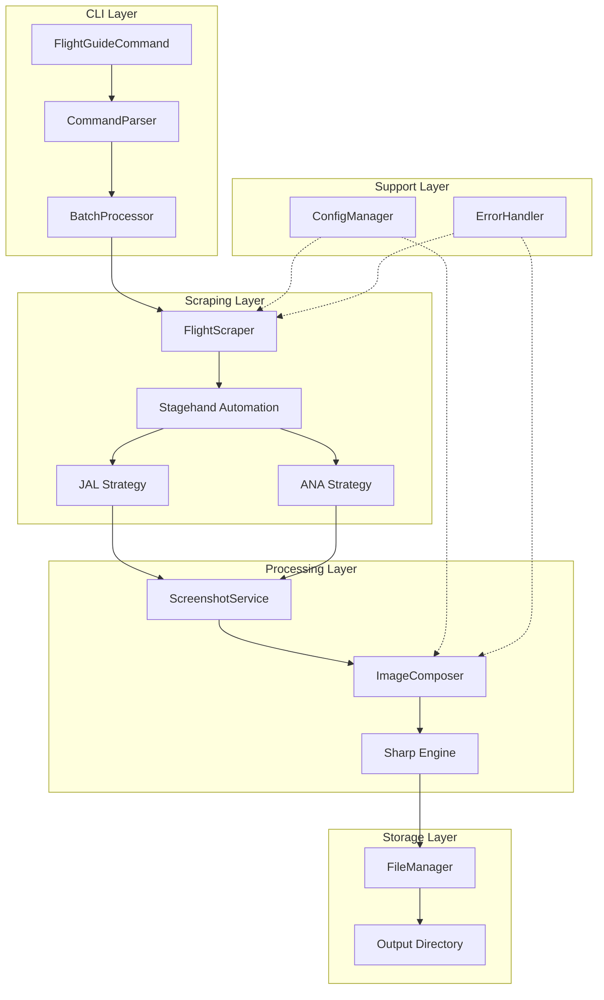
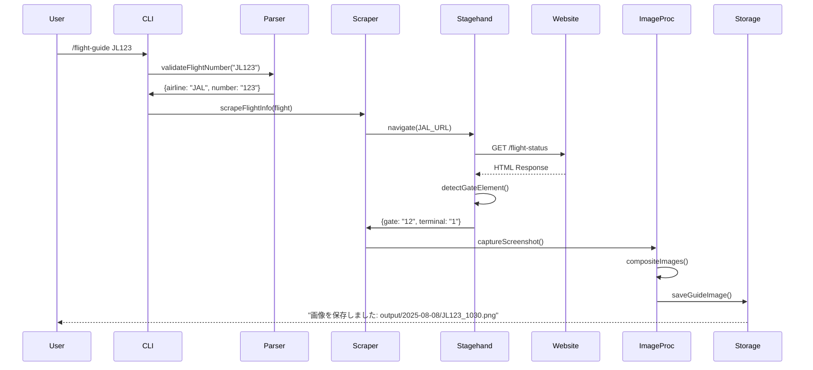
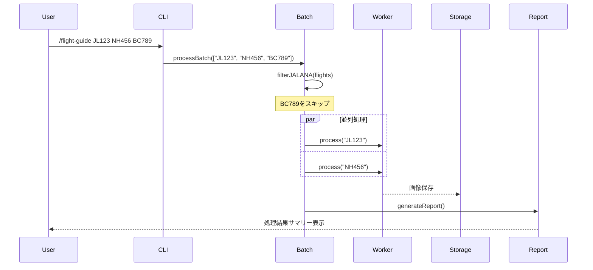
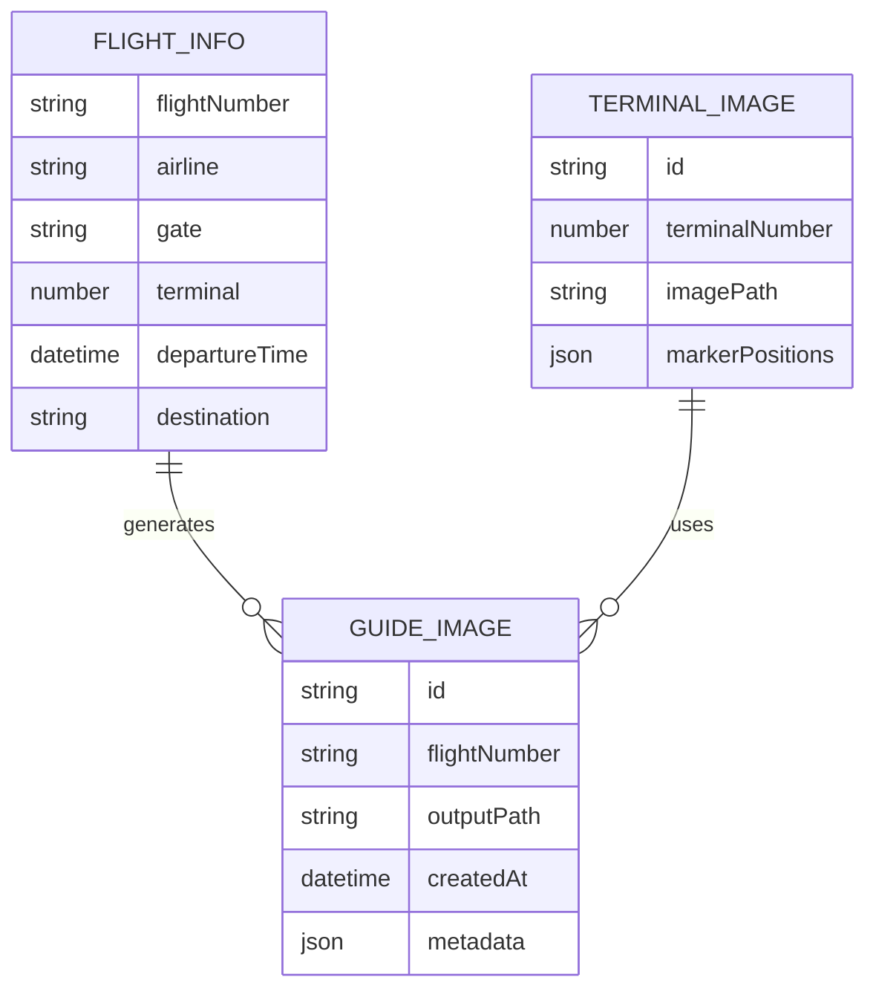
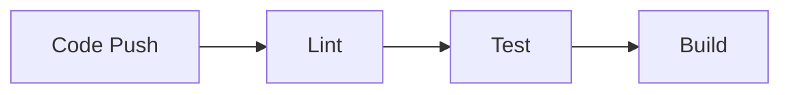

# Technical Design

## Overview

本機能は、羽田空港バレーパーキングサービスの業務効率化を目的とした搭乗口案内画像自動生成ツールです。
便名を入力として、JAL・ANAの公式サイトから搭乗口情報を自動取得し、ターミナル画像と合成して顧客向け案内画像を生成します。
既存のHEXプロジェクトのReact/Inkベースのインタラクティブコマンドラインツールとして実装され、Stagehandを活用したブラウザ自動操作により手動作業を大幅に削減します。

## Requirements Mapping

### Design Component Traceability
各設計コンポーネントが対応する要件：
- **コマンドパーサー（CommandParser）** → REQ-1: 便名入力と検証
- **フライト情報スクレイパー（FlightScraper）** → REQ-2: 搭乗口情報の取得、REQ-10: 対応航空会社
- **スクリーンショットサービス（ScreenshotService）** → REQ-3: スクリーンショット撮影
- **画像合成エンジン（ImageComposer）** → REQ-4: ターミナル画像との合成
- **ファイルマネージャー（FileManager）** → REQ-5: 出力ファイル管理
- **設定管理（ConfigManager）** → REQ-6: 設定とカスタマイズ
- **エラーハンドラー（ErrorHandler）** → REQ-7: エラーハンドリングとロギング
- **UIコンポーネント（FlightGuideUI）** → REQ-9: ユーザーインターフェース

### User Story Coverage
- **複数便名の効率的入力**: バッチ処理モードによるコマンドパーサーで対応
- **自動搭乗口情報取得**: Stagehandを使用したインテリジェント要素検出で実現
- **証跡スクリーンショット**: Playwrightの高品質スクリーンショット機能で対応
- **視覚的に分かりやすい案内画像**: Sharp による高速画像合成
- **適切なファイル管理**: 日付/便名ベースの自動命名規則で整理
- **柔軟な設定管理**: JSONベース設定ファイルとホットリロード対応
- **エラー時の詳細情報**: 構造化ログとユーザーフレンドリーメッセージの二層化
- **迅速な処理**: シンプルな実装による適切な処理速度
- **直感的UI**: InkコンポーネントによるインタラクティブターミナルUI
- **JAL/ANA国内線対応**: 航空会社別スクレイピング戦略の実装

## Architecture

フライトガイドジェネレーターは、既存のHEXプロジェクトにモジュラーアーキテクチャで統合されます。



### Technology Stack
研究結果に基づく技術選定：

- **Frontend**: React + Ink 4.1.0 (既存プロジェクトと統合)
- **Backend**: TypeScript 5.0.3 + Bun/Node.js Runtime
- **Browser Automation**: Stagehand 2.4.2 + Playwright 1.54.2
- **Image Processing**: Sharp (高速画像合成)
- **Validation**: Zod 3.25.76 (便名・設定検証)
- **Testing**: AVA 5.2.0 + ink-testing-library 3.0.0
- **Logging**: Pino (構造化ログ)
- **Configuration**: dotenv + JSON設定ファイル

### Architecture Decision Rationale
研究に基づく技術選定理由：

- **Stagehand選択理由**: ユーザー指定の要件。Playwrightベースで高度な要素検出が可能
- **Sharp採用理由**: 画像合成で4-5倍高速、シンプルな実装で要件を満たす
- **Ink継続使用**: 既存プロジェクトとの統合性、React知識の活用
- **Zod採用**: 実行時型検証により便名形式の確実な検証
- **構造化ログ**: デバッグ効率とプロダクション監視の両立

## Data Flow

### Primary User Flows

#### 単一便名処理フロー


#### バッチ処理フロー


## Components and Interfaces

### Backend Services & Method Signatures

#### FlightScraper Service
```typescript
class FlightScraper {
    async scrapeFlightInfo(flightNumber: string): Promise<FlightInfo>  // 搭乗口情報取得
    async detectAirline(flightNumber: string): AirlineType             // 航空会社判定
    private async scrapeJAL(flightNumber: string): Promise<FlightInfo> // JAL専用処理
    private async scrapeANA(flightNumber: string): Promise<FlightInfo> // ANA専用処理
    async retryWithBackoff<T>(fn: () => Promise<T>): Promise<T>       // リトライ機構
}
```

#### ImageComposer Service
```typescript
class ImageComposer {
    async compositeImages(screenshot: Buffer, terminal: number): Promise<Buffer> // 画像合成
    async optimizeOutput(image: Buffer): Promise<Buffer>                        // 最適化
    private getCompositePosition(terminal: number): {top: number, left: number} // 合成位置計算
}
```

#### FileManager Service
```typescript
class FileManager {
    async saveImage(buffer: Buffer, flightNumber: string): Promise<string> // 画像保存
    async checkDuplicate(path: string): Promise<boolean>                   // 重複確認
    async createDateDirectory(): Promise<string>                           // 日付フォルダ作成
    async cleanupOldFiles(days: number): Promise<void>                     // 古いファイル削除
}
```

### Frontend Components

| Component Name | Responsibility | Props/State Summary |
|----------------|---------------|-------------------|
| FlightGuideCommand | メインコマンドコンポーネント | `{flights: string[], mode: 'single'\|'batch'}` |
| FlightInput | 便名入力インターフェース | `{onSubmit: (flights) => void, validation: boolean}` |
| ProgressIndicator | 処理進捗表示 | `{current: number, total: number, status: string}` |
| ResultSummary | 処理結果サマリー表示 | `{results: ProcessResult[], failures: Error[]}` |
| GatePreview | 搭乗口情報プレビュー | `{flightInfo: FlightInfo, imageUrl?: string}` |
| ErrorDisplay | エラー情報表示 | `{error: Error, suggestions: string[]}` |
| ConfigEditor | 設定編集UI | `{config: Config, onChange: (config) => void}` |

### API Endpoints

内部コマンドAPI（CLIコマンドとして実装）：

| Command | Route Pattern | Purpose | Auth | Response |
|---------|--------------|---------|------|----------|
| flight-guide | `/flight-guide [flights...]` | 搭乗口案内画像生成 | N/A | 画像パス |
| flight-config | `/flight-config set <key> <value>` | 設定変更 | N/A | 確認メッセージ |
| flight-config | `/flight-config get [key]` | 設定取得 | N/A | 設定値 |
| flight-batch | `/flight-batch <file>` | CSVバッチ処理 | N/A | 処理結果 |
| flight-clean | `/flight-clean [days]` | 古いファイル削除 | N/A | 削除数 |

## Data Models

### Domain Entities
1. **FlightInfo**: 便情報と搭乗口データ
2. **TerminalImage**: ターミナル画像テンプレート
3. **GuideImage**: 生成された案内画像
4. **ProcessResult**: 処理結果とメタデータ
5. **Configuration**: アプリケーション設定

### Entity Relationships


### Data Model Definitions

```typescript
// 便情報
interface FlightInfo {
  flightNumber: string;      // 便名 (例: "JL123")
  airline: "JAL" | "ANA";     // 航空会社
  gate?: string;              // 搭乗口 (例: "12")
  terminal: 1 | 2 | 3;        // ターミナル番号
  departureTime: Date;        // 出発時刻
  destination: string;        // 目的地
  status: "on-time" | "delayed" | "cancelled" | "gate-unassigned";
  updatedAt: Date;
}

// 処理結果
interface ProcessResult {
  flightNumber: string;
  success: boolean;
  outputPath?: string;
  error?: Error;
  processingTime: number;      // ミリ秒
  retryCount: number;
  metadata: {
    screenshotPath?: string;
    gateInfo?: FlightInfo;
    skippedReason?: string;
  };
}

// 設定
interface FlightGuideConfig {
  terminals: {
    1: { imagePath: string; screenshotPosition: Point; };
    2: { imagePath: string; screenshotPosition: Point; };
    3: { imagePath: string; screenshotPosition: Point; };
  };
  output: {
    directory: string;
    format: "png" | "jpeg";
    quality: number;          // 1-100
    fileNamePattern: string;  // e.g., "{date}/{flight}_{time}.{ext}"
  };
  scraping: {
    timeout: number;          // ミリ秒
    retryAttempts: number;
    retryDelay: number;       // ミリ秒
    headless: boolean;
  };
  processing: {
    compositeBlend: "over" | "multiply" | "screen";  // 合成モード
    screenshotScale: number;  // スクリーンショットのスケール (0.1-1.0)
  };
}
```

### Database Schema
本機能ではデータベースは使用せず、ファイルシステムベースの保存を採用：

```
output/
├── 2025-08-08/
│   ├── JL123_1030.png
│   ├── NH456_1145.png
│   └── metadata.json
├── 2025-08-09/
│   └── ...
└── archive/
    └── ...
```

### Migration Strategy
- 初回起動時に必要なディレクトリ構造を自動作成
- 設定ファイルのバージョン管理とマイグレーション
- 古い画像の自動アーカイブ機能

## Error Handling

### エラー分類と対処

```typescript
enum ErrorType {
  VALIDATION_ERROR = "VALIDATION_ERROR",           // 入力検証エラー
  NETWORK_ERROR = "NETWORK_ERROR",                 // ネットワーク障害
  SCRAPING_ERROR = "SCRAPING_ERROR",               // スクレイピング失敗
  ELEMENT_NOT_FOUND = "ELEMENT_NOT_FOUND",         // 要素検出失敗
  IMAGE_PROCESSING_ERROR = "IMAGE_PROCESSING_ERROR", // 画像処理エラー
  FILE_SYSTEM_ERROR = "FILE_SYSTEM_ERROR",         // ファイル操作エラー
  CONFIG_ERROR = "CONFIG_ERROR",                   // 設定エラー
}

class ErrorHandler {
  handleError(error: AppError): ErrorResponse {
    switch(error.type) {
      case ErrorType.NETWORK_ERROR:
        return { retry: true, message: "ネットワーク接続を確認してください" };
      case ErrorType.ELEMENT_NOT_FOUND:
        return { retry: false, message: "搭乗口情報が見つかりません", fallback: "full-screenshot" };
      // ... 他のエラータイプ
    }
  }
}
```

## Testing Strategy

### Testing Approach

個人開発者向けのシンプルなテスト戦略：

- **基本的なユニットテスト**: ビジネスロジックの検証
- **最小限の統合テスト**: 主要フローの動作確認
- **手動テスト**: 実際の便名での動作確認

#### 1. Unit Testing
```typescript
// 便名検証のテスト
test('validates JAL flight numbers', async t => {
  const validator = new FlightValidator();
  t.true(validator.validate('JL123'));
  t.false(validator.validate('XX999'));
});

// 航空会社判定のテスト
test('detects airline from flight number', async t => {
  t.is(detectAirline('JL123'), 'JAL');
  t.is(detectAirline('NH456'), 'ANA');
  t.is(detectAirline('BC789'), 'UNSUPPORTED');
});

// ターミナル番号変換のテスト
test('converts terminal string to number', async t => {
  t.is(parseTerminal('第1ターミナル'), 1);
  t.is(parseTerminal('Terminal 2'), 2);
  t.is(parseTerminal('T3'), 3);
});

// ファイル命名規則のテスト
test('generates correct file name', async t => {
  const fileName = generateFileName('JL123', new Date('2025-08-08T10:30:00'));
  t.is(fileName, '2025-08-08/JL123_1030.png');
});
```

#### 2. Integration Testing
```typescript
// FlightScraperの入出力検証
test('FlightScraper transforms Stagehand response correctly', async t => {
  const scraper = new FlightScraper({
    stagehand: mockStagehandResponse({
      gate: "12番ゲート",
      terminal: "第1ターミナル",
      status: "定刻"
    })
  });
  
  const result = await scraper.scrapeFlightInfo('JL123');
  
  // 正規化された出力を検証
  t.deepEqual(result, {
    flightNumber: 'JL123',
    airline: 'JAL',
    gate: '12',
    terminal: 1,
    status: 'on-time'
  });
});

// エラーハンドリングのテスト
test('handles gate unassigned status', async t => {
  const scraper = new FlightScraper({
    stagehand: mockStagehandResponse({
      gate: "未定",
      terminal: "第2ターミナル"
    })
  });
  
  const result = await scraper.scrapeFlightInfo('NH456');
  t.is(result.status, 'gate-unassigned');
  t.is(result.gate, undefined);
});

// タイムアウト処理のテスト
test('handles timeout gracefully', async t => {
  const scraper = new FlightScraper({
    stagehand: mockDelayedResponse(30000) // 30秒遅延
  });
  
  const result = await scraper.scrapeFlightInfo('JL789');
  t.is(result.error.type, 'TIMEOUT');
});
```

### CI/CD Pipeline
