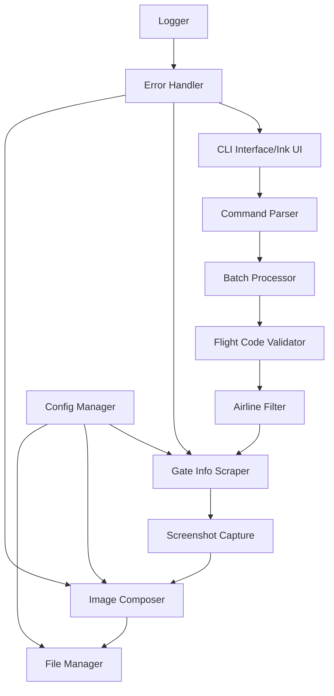
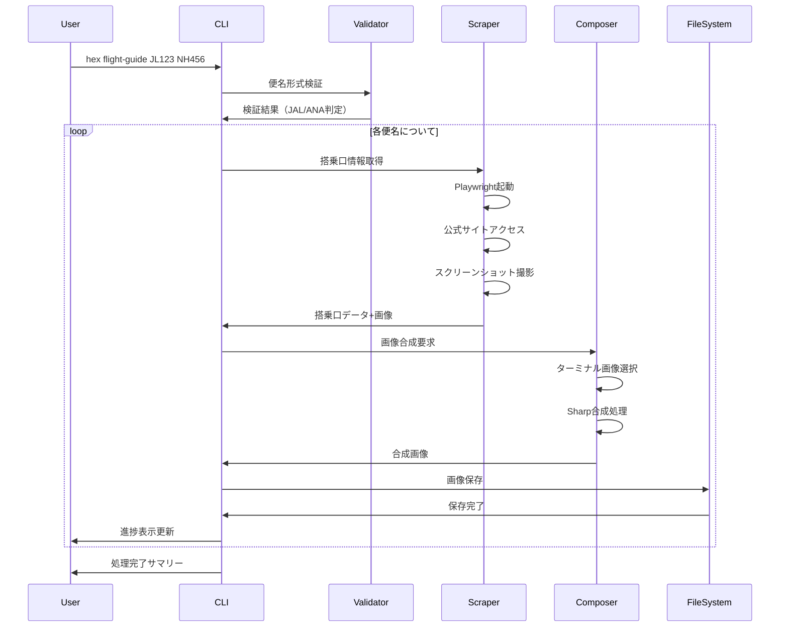
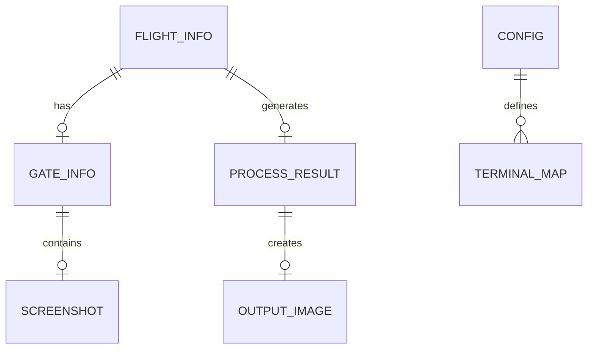
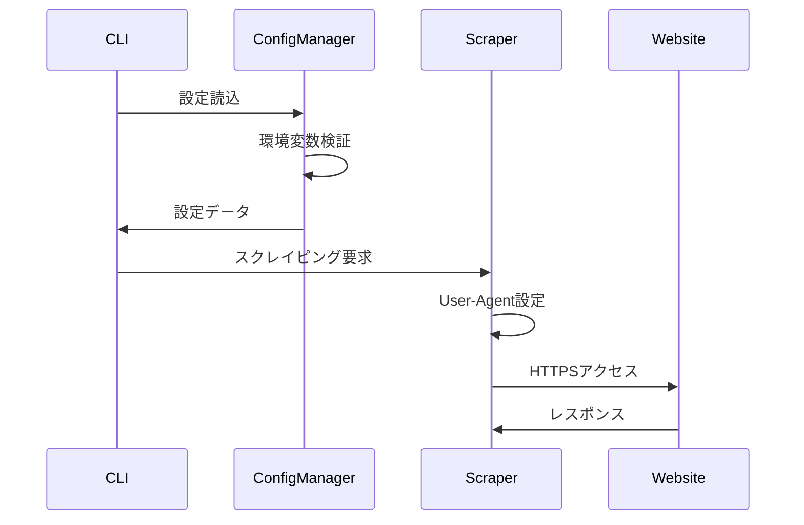
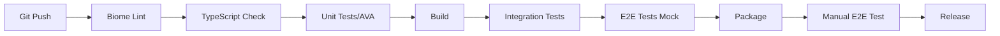

# Technical Design

## Overview

フライトパーキングの搭乗口案内画像自動生成システムは、TypeScript/React（Ink）ベースのCLIツールとして実装されます。Playwright/Stagehandを活用して航空会社公式サイトから搭乗口情報を取得し、Sharpライブラリで画像合成を行います。バッチ処理に対応し、複数の便名を効率的に処理できる設計とします。

## Requirements Mapping

### Design Component Traceability

各設計コンポーネントが対応する要件：

- **FlightCodeValidator** → REQ-1: 便名入力と検証（形式検証、航空会社識別）
- **GateInfoScraper** → REQ-2: 搭乗口情報の取得（JAL/ANA公式サイト対応）
- **ScreenshotCapture** → REQ-3: スクリーンショット撮影（証跡画像取得）
- **ImageComposer** → REQ-4: ターミナル画像との合成（搭乗口マーキング）
- **FileManager** → REQ-5: 出力ファイル管理（日付/便名形式での保存）
- **ConfigManager** → REQ-6: 設定とカスタマイズ（ターミナル画像パス管理）
- **ErrorHandler** → REQ-7: エラーハンドリングとロギング（詳細ログ記録）
- **BatchProcessor** → REQ-8: パフォーマンスと信頼性（バッチ処理機能）
- **CLIInterface** → REQ-9: ユーザーインターフェース（Inkベースの対話的UI）
- **AirlineFilter** → REQ-10: 対応航空会社（JAL/ANA判定とフィルタリング）

### User Story Coverage

- **複数便名の効率的入力**: BatchProcessorとCLIInterfaceが連携してバッチ入力を処理
- **自動搭乗口取得**: GateInfoScraperがPlaywrightで航空会社サイトを自動操作
- **証跡スクリーンショット**: ScreenshotCaptureが搭乗口情報の証拠画像を保存
- **自動画像合成**: ImageComposerがSharpで搭乗口位置をマーキング
- **適切な保存管理**: FileManagerが日付別フォルダに整理して保存

## Architecture



### Technology Stack

研究結果に基づく技術選定：

- **Frontend CLI**: Ink 4.1.0 + React 18.2.0 + TypeScript
- **Command Parser**: Meow 11.0.0（引数解析）
- **Web Automation**: Playwright 1.54.2 + Stagehand 2.4.2（ブラウザ自動化）
- **Image Processing**: Sharp（高速画像合成）+ SVGテキストオーバーレイ
- **Validation**: Zod 3.25.76（便名形式検証）
- **Configuration**: dotenv + JSON設定ファイル
- **Logging**: Winston/Pino（構造化ログ）
- **Testing**: AVA + ink-testing-library + Playwright Test

### Architecture Decision Rationale

- **Ink Framework採用理由**: プロジェクトの既存技術スタックとの統合性、Reactパターンによる保守性向上
- **Playwright選択理由**: 動的コンテンツ対応、ヘッドレスモード対応、マルチブラウザサポート
- **Sharp採用理由**: Node.js最速の画像処理ライブラリ、ImageMagickより4-5倍高速
- **Zod検証理由**: TypeScript型安全性、ランタイム検証、エラーメッセージのカスタマイズ性

## Data Flow

### Primary User Flows

メインフロー：複数便名のバッチ処理



## Components and Interfaces

### Backend Services & Method Signatures

```typescript
// 便名検証サービス
class FlightCodeValidator {
    validateFormat(code: string): ValidationResult          // 便名形式検証
    extractAirline(code: string): Airline                  // 航空会社識別
    validateBatch(codes: string[]): ValidationResult[]     // バッチ検証
}

// 搭乗口情報取得サービス  
class GateInfoScraper {
    async scrapeJAL(flightCode: string): Promise<GateInfo>    // JAL搭乗口取得
    async scrapeANA(flightCode: string): Promise<GateInfo>    // ANA搭乗口取得
    async captureScreenshot(page: Page): Promise<Buffer>      // スクリーンショット
}

// 画像合成サービス
class ImageComposer {
    async loadTerminalMap(terminal: Terminal): Promise<Sharp>     // ターミナル画像読込
    async overlayGateInfo(base: Buffer, info: GateInfo): Promise<Buffer>  // 情報オーバーレイ
    async addTextAnnotation(image: Buffer, text: string): Promise<Buffer> // テキスト追加
}

// ファイル管理サービス
class FileManager {
    generateFilePath(flight: string, date: Date): string      // パス生成
    async saveImage(path: string, buffer: Buffer): Promise<void>  // 画像保存
    async checkConflict(path: string): Promise<boolean>       // 重複チェック
}
```

### Frontend Components

| Component Name | Responsibility | Props/State Summary |
|---|---|---|
| `<App>` | メインアプリケーションコンテナ | flights[], currentIndex, status |
| `<BatchInput>` | 便名入力インターフェース | onSubmit, validation |
| `<ProgressBar>` | バッチ処理進捗表示 | current, total, percentage |
| `<FlightStatus>` | 個別便処理状態表示 | flight, status, gateInfo |
| `<ResultSummary>` | 処理結果サマリー | successful[], failed[], skipped[] |
| `<ErrorDisplay>` | エラー詳細表示 | error, suggestions |
| `<ConfigEditor>` | 設定編集UI | config, onSave |

### API Endpoints

内部コマンドインターフェース（CLIコマンド）：

| Command | Route | Purpose | Options | Output |
|---|---|---|---|---|
| hex | flight-guide [flights...] | 搭乗口案内画像生成 | --output, --config | 生成画像パス |
| hex | flight-guide --batch FILE | バッチファイル処理 | --output, --parallel | 処理結果JSON |
| hex | flight-guide --config | 設定表示/編集 | --edit, --reset | 設定内容 |
| hex | flight-guide --help | ヘルプ表示 | - | 使用方法 |

## Data Models

### Domain Entities

1. **FlightInfo**: 便名と航空会社情報
2. **GateInfo**: 搭乗口と関連情報
3. **ProcessResult**: 処理結果と生成画像パス
4. **Config**: アプリケーション設定

### Entity Relationships



### Data Model Definitions

```typescript
// TypeScript インターフェース定義

interface FlightInfo {
  id: string;
  code: string;              // 便名 (例: JL123)
  airline: 'JAL' | 'ANA' | 'OTHER';
  departureDate: Date;
  status: 'pending' | 'processing' | 'completed' | 'failed' | 'skipped';
  createdAt: Date;
  updatedAt: Date;
}

interface GateInfo {
  flightId: string;
  gateNumber: string;        // 搭乗口番号
  terminal: 1 | 2 | 3;       // ターミナル番号
  departureTime: string;
  boardingTime?: string;
  status: 'confirmed' | 'tentative' | 'unknown';
  screenshotPath?: string;
  scrapedAt: Date;
}

interface ProcessResult {
  flightId: string;
  success: boolean;
  outputImagePath?: string;
  thumbnailPath?: string;
  error?: ErrorDetail;
  processingTime: number;    // ミリ秒
  createdAt: Date;
}

interface Config {
  outputDirectory: string;
  terminalMaps: {
    terminal1: string;
    terminal2: string;
    terminal3: string;
  };
  imageQuality: number;      // 1-100
  parallel: boolean;
  maxRetries: number;
  timeout: number;           // ミリ秒
  airlines: {
    JAL: { url: string; selector: string };
    ANA: { url: string; selector: string };
  };
}
```

### Database Schema

ローカルファイルベースストレージ（データベース不要）：

```
.hex-flight-guide/
├── config.json              # アプリケーション設定
├── logs/                    # ログファイル
│   └── 2025-08-08.log
├── cache/                   # 一時キャッシュ
│   └── screenshots/
└── output/                  # 生成画像
    └── 2025-08-08/
        ├── JL123_1430.png
        └── NH456_1600.png
```

### Migration Strategy

- 設定ファイルバージョニング（config.version）
- 後方互換性のためのデフォルト値提供
- 設定移行スクリプトの自動実行
- 古い形式の検出と警告表示

## Error Handling

### エラー分類と対処

```typescript
enum ErrorType {
  VALIDATION_ERROR = 'VALIDATION_ERROR',           // 入力検証エラー
  NETWORK_ERROR = 'NETWORK_ERROR',                 // ネットワーク接続エラー
  SCRAPING_ERROR = 'SCRAPING_ERROR',              // スクレイピング失敗
  IMAGE_PROCESSING_ERROR = 'IMAGE_PROCESSING_ERROR', // 画像処理エラー
  FILE_SYSTEM_ERROR = 'FILE_SYSTEM_ERROR',        // ファイル操作エラー
  CONFIG_ERROR = 'CONFIG_ERROR',                  // 設定エラー
  TIMEOUT_ERROR = 'TIMEOUT_ERROR',                // タイムアウト
}

class ErrorHandler {
  handleError(error: Error, context: Context): ErrorResponse {
    // エラータイプに応じた処理
    // リトライ可能性の判定
    // ユーザーフレンドリーメッセージ生成
    // ログ記録
  }
}
```

## Security Considerations

### Authentication & Authorization



### Data Protection

- 入力検証: Zodスキーマによる厳密な便名形式検証
- XSS対策: SVGテキスト生成時のサニタイゼーション
- パス・トラバーサル対策: ファイルパスの正規化と検証
- 環境変数: dotenvによる秘密情報の分離管理

### Security Best Practices

- レート制限: 航空会社サイトへのアクセス間隔制御（最小1秒）
- プロキシローテーション: 検出回避のためのIPローテーション
- ヘッドレスモード: ブラウザ自動化の隠蔽
- User-Agent偽装: 実際のブラウザと同じUser-Agent使用
- CAPTCHAハンドリング: 手動介入フォールバック

## Performance & Scalability

### Performance Targets

| Metric | Target | Measurement |
|---|---|---|
| 単一便処理時間 | < 10秒 | 入力から画像生成まで |
| バッチ処理（10便） | < 60秒 | 並列処理時 |
| メモリ使用量 | < 500MB | ピーク時 |
| CPU使用率 | < 80% | 処理中 |
| 画像生成時間 | < 2秒 | Sharp処理 |
| スクレイピング成功率 | > 95% | リトライ込み |

### Caching Strategy

- **ブラウザキャッシュ**: Playwrightセッション保持
- **画像キャッシュ**: ターミナル画像のメモリキャッシュ
- **搭乗口キャッシュ**: 1時間有効の搭乗口情報キャッシュ
- **設定キャッシュ**: 起動時読込、変更監視

### Scalability Approach

- 並列処理: 最大5便同時処理（設定可能）
- ブラウザプール: 複数Playwrightインスタンス管理
- メモリ管理: 処理完了後の即時リソース解放
- エラー分離: 個別便のエラーが全体に影響しない設計

## Testing Strategy

### Test Coverage Requirements

- **Unit Tests**: ≥85% コードカバレッジ
- **Integration Tests**: 全主要フロー網羅
- **E2E Tests**: 実際の航空会社サイトでの動作確認
- **Performance Tests**: 10便同時処理のストレステスト

### Testing Approach

1. **Unit Testing**
   - FlightCodeValidator: 様々な便名パターンテスト
   - ImageComposer: 画像合成ロジックテスト
   - FileManager: ファイルパス生成テスト

2. **Integration Testing**
   - CLIコマンド実行テスト
   - 設定ファイル読込テスト
   - エラーハンドリングフロー

3. **End-to-End Testing**
   - 実際のJAL/ANAサイトでのスクレイピング
   - 画像生成から保存までの全フロー
   - バッチ処理の正常動作確認

4. **Performance Testing**
   - 並列処理の負荷テスト
   - メモリリーク検証
   - タイムアウト処理確認

### CI/CD Pipeline



## Implementation Phases

### Phase 1: 基盤構築（2日）
- プロジェクト構造セットアップ
- 基本CLIインターフェース実装
- 設定管理システム構築

### Phase 2: 検証とフィルタリング（1日）
- 便名検証ロジック実装
- 航空会社判定機能
- バッチ入力処理

### Phase 3: スクレイピング機能（3日）
- Playwright統合
- JAL/ANAサイト対応
- スクリーンショット機能

### Phase 4: 画像処理（2日）
- Sharp統合
- 画像合成ロジック
- テキストオーバーレイ

### Phase 5: 統合とテスト（2日）
- 全機能統合
- エラーハンドリング
- テスト実装

## Dependencies

```json
{
  "dependencies": {
    "ink": "^4.1.0",
    "react": "^18.2.0",
    "meow": "^11.0.0",
    "playwright": "^1.54.2",
    "@stagehand/lib": "^2.4.2",
    "sharp": "^0.33.0",
    "zod": "^3.25.76",
    "winston": "^3.11.0",
    "dotenv": "^16.4.5",
    "ink-spinner": "^5.0.0",
    "ink-progress-bar": "^3.0.0"
  },
  "devDependencies": {
    "@types/node": "^20.0.0",
    "ava": "^5.2.0",
    "ink-testing-library": "^3.0.0",
    "@playwright/test": "^1.54.2"
  }
}
```

## Risk Mitigation

### 技術リスク
- **航空会社サイト変更**: セレクタの定期更新体制、フォールバック処理
- **CAPTCHA出現**: 手動介入通知、代替手段の提供
- **レート制限**: アクセス間隔調整、プロキシ使用

### 運用リスク
- **大量処理時の負荷**: 並列数制限、リソース監視
- **画像ストレージ**: 定期クリーンアップ、容量監視
- **エラー頻発**: 詳細ログ、アラート通知